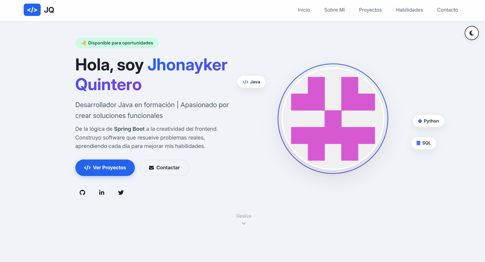

# 💼 Portafolio Personal - Jhonayker Quintero

<div align="center">

# 👋 Hola, soy **Jhonayker Quintero**

### 🚀 Desarrollador Java en formación

Construyendo soluciones, un commit a la vez.

---


### Tecnologías


---

🌐 **Demo en vivo:** *(Agrega aquí el enlace de GitHub Pages)*

📂 **Repositorio:** https://github.com/Jhonayker777

💼 **LinkedIn:** https://linkedin.com/in/jhonayker-quintero

📧 **Correo:** jhon117.hello@gmail.com

</div>

---

# 📑 Tabla de Contenidos

- 📖 Descripción General
- ✨ Características
- 🛠 Tecnologías
- 📂 Estructura del Proyecto
- 🎨 Diseño
- 📱 Responsive Design
- 📌 Secciones del Portafolio
- ⚙ Instalación
- 🚀 Despliegue
- 🎯 Personalización
- 📬 Contacto
- 📄 Licencia

---

# 📖 Descripción General

Este proyecto corresponde a mi **portafolio personal como desarrollador Java en formación**, diseñado para mostrar mis proyectos, habilidades técnicas y trayectoria de aprendizaje.

El sitio está desarrollado con tecnologías web modernas utilizando **HTML5, CSS3 y JavaScript Vanilla**, implementando buenas prácticas de desarrollo, diseño responsivo y una experiencia de usuario atractiva.

Su objetivo principal es servir como carta de presentación para reclutadores, empresas y colaboradores interesados en conocer mi trabajo.

---

# ✨ Características

## 🎨 Interfaz moderna

- Diseño limpio y profesional
- Tema claro/oscuro
- Animaciones suaves
- Tipografía moderna (Inter)

## 📱 Responsive

- Desktop
- Tablet
- Mobile

## ⚡ Funcionalidades

- Menú fijo
- Scroll Spy
- Menú hamburguesa
- Botón volver arriba
- Filtros de proyectos
- Carga dinámica de proyectos
- Validación de formularios
- Toast Notifications
- Persistencia del tema mediante LocalStorage
- Accesibilidad mediante atributos ARIA

---

# 🛠 Tecnologías Utilizadas

## Frontend

- HTML5 Semántico
- CSS3
  - Flexbox
  - Grid
  - Variables CSS
  - Keyframes
- JavaScript ES6+

## Librerías

- Font Awesome 6
- Google Fonts (Inter)

## Despliegue

- GitHub Pages

## Herramientas

- Git
- GitHub
- VS Code
- Emailjs

---

# 📂 Estructura del Proyecto

```
portfolio/
│
├── index.html
|
├── styles.css
│
├── script.js
│   
├── fotos/
│   ├── images
│   
├── README.md

```

---

# 🎨 Diseño

El portafolio fue diseñado bajo principios de:

- Minimalismo
- Accesibilidad
- Experiencia de Usuario (UX)
- Diseño Moderno
- Navegación intuitiva
- Alto rendimiento

Incluye múltiples animaciones para mejorar la interacción sin afectar la velocidad del sitio.

---

# 📱 Responsive Design

El sitio se adapta automáticamente a cualquier dispositivo.

| Dispositivo | Resolución |
|-------------|-----------|
| 💻 Desktop | >1024px |
| 📱 Tablet | 768px - 1024px |
| 📲 Mobile | <768px |

---

# 📌 Secciones del Portafolio

## 🏠 Inicio

- Presentación
- Redes sociales
- Imagen de perfil
- Badge de disponibilidad
- Botones de acción

---

## 👨‍💻 Sobre Mí

Incluye información sobre:

### Personal

- Aprendizaje continuo
- Trabajo en equipo
- Resolución de problemas

### Académico

Conocimientos en:

- HTML
- CSS
- JavaScript
- Python
- SCRUM

Próximo enfoque:

- Java
- Spring Boot

---

## 🚀 Proyectos

Actualmente el portafolio incluye:

### 🐶 Fundación Patitas Felices

HTML5 • CSS3

---

### 🧰 Sistema de Gestión de Herramientas

Python • JSON • CSV • POO

---

### 💼 Landing Page - Portafolio Personal

HTML5 • CSS3 • JavaScript

---

### 💰 Memo Finanzas

HTML5 • CSS3 • JavaScript • DOM

---

### 🧬 Biología Celular

HTML5 • CSS3 • JavaScript

---

### 🍰 Delicias del Ayer

- HTML5
- CSS 3
- JavaScript
- Google Fonts
- Material Symbols
- WorldTimeAPI
- Google Maps

---

### 🚌 Rutas Seguras Kids

- HTML5
- CSS3
- JavaScript
- LocalStorage
- WeatherAPI
- Geolocation API
- Web Components
- Shadow DOM
- Git
- GitHub

---

Los proyectos pueden filtrarse por:

- Todos
- Java
- Python
- Frontend
- Database

Además incluye un botón de **Cargar Más** para mostrar progresivamente el contenido.

---

## 📊 Habilidades

| Tecnología | Nivel |
|------------|--------|
| HTML5 | 85% |
| CSS3 | 80% |
| Java | 10% |
| Spring Boot | 20% |
| Python | 75% |
| JavaScript | 50% |
| MySQL | 55% |
| Git & GitHub | 80% |

### Metodologías y herramientas

- SCRUM
- postgrestSQL
- Oracol
- stich
- visual Parading

---

## 📬 Contacto

Incluye:

- Correo electrónico
- GitHub
- LinkedIn
- Teléfono

Además incorpora un formulario con validación en tiempo real para facilitar el contacto.

---

## 📸 Capturas de Pantalla

A continuación se muestran algunas vistas del portafolio en diferentes secciones y dispositivos.

### 🏠 Página de Inicio



---

### 👨‍💻 Sobre Mí


---

### 🚀 Proyectos


---

### 📊 Habilidades


---

### 📬 Contacto


---

### 🌙 Tema Oscuro


---

### 📱 Versión Responsive

| Desktop                                      | Tablet                                     | Mobile                                     |
| -------------------------------------------- | ------------------------------------------ | ------------------------------------------ |
|  | |  |

> **Nota:** Las imágenes corresponden a la versión más reciente del portafolio y pueden actualizarse conforme evolucione el proyecto.


# ⚙ Instalación

Clonar el repositorio

```bash
git clone https://github.com/Jhonayker777/portfolio.git
```

Entrar al proyecto

```bash
cd portfolio
```

Abrir el proyecto

```bash
index.html
```

O utilizar Live Server desde Visual Studio Code.

---

# 🚀 Despliegue

Este proyecto está preparado para desplegarse fácilmente mediante **GitHub Pages**.

Pasos:

1. Subir el proyecto al repositorio.
2. Ir a **Settings**.
3. Abrir **Pages**.
4. Seleccionar la rama **main**.
5. Guardar los cambios.
6. GitHub generará automáticamente el sitio web.

---

# 🎯 Personalización

Puedes personalizar fácilmente el proyecto modificando:

- Información personal
- Imagen de perfil
- Redes sociales
- Colores mediante Variables CSS
- Proyectos
- Habilidades
- Tecnologías
- Tema oscuro
- Iconos
- Animaciones

---

# 📬 Contacto

## 👤 Jhonayker Quintero

📧 **Correo**

jhon117.hello@gmail.com

📱 **Teléfono**

+57 350 711 8018

💼 **LinkedIn**

https://linkedin.com/in/jhonayker-quintero

💻 **GitHub**

https://github.com/Jhonayker777

---

# 🤝 ¿Te interesa trabajar conmigo?

Actualmente me encuentro fortaleciendo mis conocimientos en **Java y Spring Boot**, desarrollando proyectos que me permiten aplicar buenas prácticas de programación, diseño de interfaces y resolución de problemas.

Siempre estoy abierto a nuevas oportunidades, retos profesionales y colaboraciones donde pueda seguir creciendo como desarrollador.

⭐ Si este proyecto te resultó interesante, no dudes en darle una estrella al repositorio o contactarme.

---

# 📄 Licencia

Este proyecto se distribuye bajo la licencia **MIT**.

Puedes utilizarlo como referencia para proyectos personales y educativos.

---

<div align="center">

### ⭐ Gracias por visitar mi portafolio

**Construyendo soluciones, un commit a la vez.**

</div>

